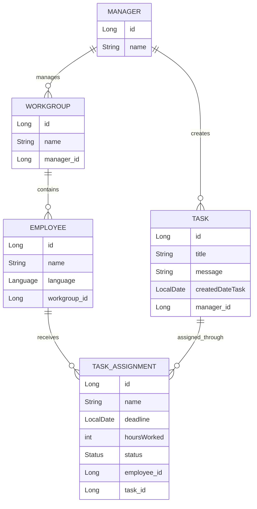

# Management Workflow API

A Spring Boot REST API for managing multilingual workgroups, tasks, and task assignments.

---

## Live Demo

**Swagger UI:**  
[Open API Documentation](https://manager-translation.onrender.com/swagger-ui/index.html#/employee-controller/getAllEmployees)

---

## Overview

Management Workflow API is a backend application that simulates a real-world management system for teams with employees who speak different languages.

Managers can create workgroups, add employees, create tasks, and automatically assign translated task versions to employees based on their language.

Example workflow:

> A manager creates one task → the system groups employees by language → translates the task → creates translated task versions → assigns them to the correct employees.

---

## Entity Relationship Model



---

## Example Workflow

Imagine a manager needs to send one task to a workgroup that contains:

- Turkish-speaking employees
- Arabic-speaking employees
- Polish-speaking employees
- French-speaking employees

Instead of manually translating the task and assigning it several times, the manager starts one workflow.

The system then:

1. Loads the selected workgroup.
2. Retrieves all employees in that workgroup.
3. Groups employees by language.
4. Translates the task message for each language.
5. Creates translated task versions.
6. Creates task assignments for the employees.
7. Tracks each assignment by deadline and status.

This turns a manual multilingual assignment process into an automated backend workflow.

---

## Core Features

- Manager management
- Workgroup management
- Employee management
- Task creation and management
- Task assignment tracking
- Automatic task translation workflow
- Employee grouping by language
- Status tracking: `TODO`, `IN_PROGRESS`, `DONE`, `OVERDUE`
- Bean Validation for request data
- Global exception handling
- Scheduled overdue-task detection
- Unit tests with JUnit and Mockito
- Swagger/OpenAPI documentation

---

## Tech Stack

- Java 21
- Spring Boot
- Spring Data JPA
- Hibernate
- H2 Database
- Maven
- Lombok
- Swagger/OpenAPI
- JUnit
- Mockito

---

## Architecture

The application follows a layered backend architecture:

```text
Controller
    ↓
Service
    ↓
Repository
    ↓
Database
```

This structure separates API handling, business logic, persistence logic, and database access.

---

## Business Logic

The central business logic is the multilingual task assignment workflow.

When a manager creates a task for a workgroup, the application does not simply store the task. Instead, it processes the workgroup, detects the languages spoken by employees, creates translated task versions, and assigns the correct version to each employee.

This demonstrates:

- Domain modeling
- Service-layer orchestration
- Entity relationships
- DTO usage
- Validation
- Exception handling
- Automated workflow logic

---

## Project Purpose

This project was built as a backend portfolio project to demonstrate practical Spring Boot development.

It shows the ability to model a real-world workflow, structure a backend application cleanly, work with relational data, and implement business logic beyond simple CRUD operations.
