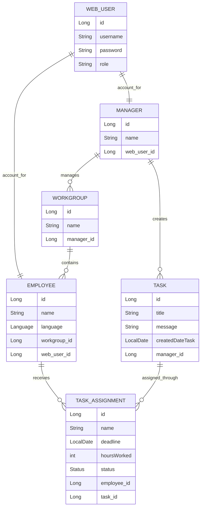

# Management Workflow API

A Spring Boot REST API for managing multilingual workgroups, tasks, task assignments, and authenticated users.

---

## Live Demo

## Try the Project

Want to see the application in action? You can explore the workflow in three ways:

**🌐 Live Demo**
[Open the deployed application](https://manager-translation-frontend.onrender.com/index.html)
Interact with the frontend and see the workflow from a user's perspective.

**▶ 20-Second Video Demo**
[Watch the demo on YouTube](https://www.youtube.com/watch?v=EEF5XDqGH98)
A quick overview of the main workflow from start to finish.

**🧪 Swagger UI / API Demo**
[Open the API documentation](https://manager-translation.onrender.com/swagger-ui/index.html#/recruiter-test-controller/testWorkFlow)
The recruiter demo endpoint automatically executes the core workflow, so no manual setup or input is required.


---

## Overview

Management Workflow API is a Spring Boot backend application that automates task distribution for multilingual teams.

Managers can create workgroups, add employees, create tasks, and automatically assign translated task versions to employees based on their language.

The application also includes Spring Security with user accounts for managers and employees. Each manager or employee is connected to a `WebUser` account through a one-to-one relationship.

Example workflow:

> A manager logs in → creates one task → the system groups employees by language → translates the task → creates translated task versions → assigns them to the correct employees.

---

## Entity Relationship Model



---

## Example Workflow

Imagine a manager needs to send one task to a workgroup that contains:

* Turkish-speaking employees
* Arabic-speaking employees
* Polish-speaking employees
* French-speaking employees

Instead of manually translating the task and assigning it several times, the manager starts one workflow.

The system then:

1. Authenticates the manager.
2. Loads the selected workgroup.
3. Retrieves all employees in that workgroup.
4. Groups employees by language.
5. Translates the task message for each language.
6. Creates translated task versions.
7. Creates task assignments for the employees.
8. Tracks each assignment by deadline and status.

This turns a manual multilingual assignment process into an automated backend workflow.

---

## Core Features

* CRUD for managers, workgroups, employees, tasks, and assignments
* Spring Security with role-based access and BCrypt passwords
* WebUser accounts linked to managers and employees
* Automated multilingual task assignment by employee language
* Assignment status tracking: `TODO`, `IN_PROGRESS`, `DONE`, `OVERDUE`
* Validation, global exception handling, overdue-task scheduling
* Unit tests and Swagger/OpenAPI documentation

---

## Tech Stack

* Java 21
* Spring Boot
* Spring Security
* Spring Data JPA
* Hibernate
* H2 Database
* Maven
* Lombok
* Swagger/OpenAPI
* JUnit
* Mockito

---

## Architecture

The application follows a layered backend architecture:

```text
Controller
    ↓
Service
    ↓
Repository
    ↓
Database
```

This structure separates API handling, business logic, persistence logic, and database access.

Security is handled through Spring Security, with authenticated `WebUser` accounts connected to business entities such as `Manager` and `Employee`.

---

## Security

This project includes **Spring Security** with HTTP Basic Authentication, BCrypt password encryption, and role-based endpoint access.

### Demo Login Accounts

| Username | Password | Role |
|---|---|---|
| `manager` | `password` | `MANAGER` |
| `anna` | `password` | `EMPLOYEE` |
| `kasia` | `password` | `EMPLOYEE` |

### Endpoint Access

| Endpoint Pattern | Access |
|---|---|
| `/swagger-ui/**`, `/v3/api-docs/**`, `/public/**`, `/h2-console/**`, `/translate/**` | Public |
| `/recruiter/**` | Public recruiter demo endpoint that activates the workflow without manual input |
| `/managers/**`, `/workgroups/**`, `/taskAssignments/**` | `MANAGER` |
| `/employees/**`, `/tasks/**` | `MANAGER` or `EMPLOYEE` |
| `/webUsers/**` | `ADMIN` |
| Other endpoints | Authenticated users |

To test protected endpoints in Swagger UI, click **Authorize** and log in with one of the demo accounts.
